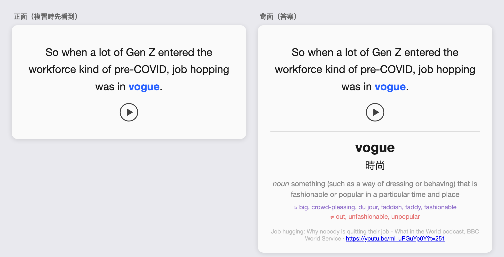

<!-- 本文件由 scripts/gen_readme_zh_cn.py 从 README.md 自动转换生成，请勿直接编辑；内容以繁体版 README.md 为准 -->

# YouTube → Anki 英文单词挖掘系统

[繁體中文](README.md) | **简体中文**

[](LICENSE)


**贴一个 YouTube 网址，自动把视频字幕变成带真人发音的 Anki 单词卡。**（完成一次性安装后，日常使用就是一行指令）



*↑ 实际成品：例句标色目标字、Merriam-Webster 英英定义、繁中释义、同反义字、从视频剪出的句子发音、可回看的时间戳链接——全部自动生成。*

<details>
<summary><b>🌐 English TL;DR</b> (for non-Chinese readers)</summary>

- **What it does**: Paste a YouTube URL → automatically mines Anki sentence cards from the video's English subtitles: target word, highlighted example sentence, Merriam-Webster definition, Chinese gloss, sentence audio clipped from the actual video, and a timestamped link back to the source.
- **Who it's for**: Chinese-speaking English learners who use Anki — the cards carry Chinese glosses, and the docs are written in Chinese.
- **Requirements**: macOS for the one-command flow (the Python pipeline itself has no OS-specific code but is untested elsewhere), Anki desktop + AnkiConnect, Python 3.10+, ffmpeg. Optional: free Merriam-Webster API keys for definitions/synonyms. Mobile review works via AnkiWeb sync (AnkiMobile on iOS is a paid app; AnkiDroid on Android is free).
- **Limitations**: word picking and sense selection are rule-based (frequency + heuristics, no LLM yet) — expect to prune a few off-target cards after each run. See the Roadmap for planned LLM-assisted disambiguation.

</details>

## ✨ 内核特色

- **一键全自动**：`./run.sh "YouTube网址"`，下载字幕视频 → 挑生字 → 制卡 → 同步 AnkiWeb 一次跑完
- **聪明挑字**：自动排除你 Anki 牌组里已有的字，用词频锁定「该学但还不会」的区间，只挑语境干净的例句
- **内容齐全**：权威字典定义、繁中释义、同反义字、真人发音 mp3，不是裸字直翻
- **可手动精修**：也支持自己挑句子挑单词的手动模式

## 目录

- [这是什么？](#what-is-this)
- [你需要准备什么](#prerequisites)
- [安装](#install)
- [快速开始](#quick-start)
- [使用方式](#usage)
- [YouTube 挡下载时：PO Token Server](#po-token-server)
- [疑难排解](#troubleshooting)
- [已知限制](#known-limitations)
- [Roadmap / Future Work](#roadmap)
- [高级：架构与项目文件](#advanced)
- [贡献与回报问题](#contributing)
- [授权](#license)

---

<a id="what-is-this"></a>
## 这是什么？

**[Anki](https://apps.ankiweb.net)** 是一款免费开源的记忆卡软件，靠「间隔重复」算法安排复习时机——快忘记的卡多出现、记熟的卡少出现，是语言学习圈公认最有效的背单词工具之一。桌面版免费，另有手机 App 可通过免费的 AnkiWeb 帐号跨设备同步（iOS 版 AnkiMobile 需在 App Store 购买，详情见该 App 说明；Android 版 AnkiDroid 免费）。

本项目则是一套喂料给 Anki 的 **sentence mining（句子挖掘）** 工具：与其背单词表，不如从你真正看的视频里收集「含生字的完整句子」来学——有语境、有声音、有画面来源，记忆效果远比孤立单词好。

挑字遵循 **i+1 原则**（输入内容只比现有程度难一点点）：每张卡的例句**只锁定一个目标生字**——排除你 Anki 牌组里已有的字后，整句刚好只含一个落在学习频率带内的新字，语境负担最小。

适合对象：用 Anki 背单词、常看英文 YouTube（需有英文 CC 字幕）、想把「看过的视频」变成「复习素材」的中文用户。

> 在 macOS（Apple Silicon）上开发与测试。一键脚本 `run.sh` 依赖 macOS 指令（如 `open -a Anki`）；内核 Python 管线理论上跨平台，但未在 Windows/Linux 验证。

---

<a id="prerequisites"></a>
## 你需要准备什么

**必需**（缺一不可）：

| 项目 | 说明 |
|---|---|
| [Anki 桌面版](https://apps.ankiweb.net)（免费） | 制卡与同步的核心，运行期间需保持打开 |
| AnkiConnect add-on（免费） | 让脚本能对 Anki 送卡，安装见下方 |
| Python 3.10+ | 运行管线 |
| Git（macOS 通常已内置） | 下载本项目；不想装也可从 GitHub 页面「Code → Download ZIP」取得 |
| ffmpeg（`brew install ffmpeg`） | 从视频切出句辅音档 |

**建议**（没有也能跑，但卡片品质差很多）：

| 项目 | 说明 |
|---|---|
| [Merriam-Webster API 密钥](https://dictionaryapi.com)（免费） | 英英定义与同反义字的来源；没设置则这两栏留空 |

**条件式**（遇到才需要）：

| 项目 | 说明 |
|---|---|
| PO Token Server | YouTube 挡下载时的解法，见[专门章节](#po-token-server) |
| 手机版 Anki | 想在手机复习才需要：iPhone 用 [AnkiMobile](https://apps.apple.com/app/ankimobile-flashcards/id373493387)（需在 App Store 购买，详情见该 App 说明）、Android 用 [AnkiDroid](https://play.google.com/store/apps/details?id=com.ichi2.anki)（免费），通过免费的 AnkiWeb 帐号同步 |

---

<a id="install"></a>
## 安装

### 1. 安装 AnkiConnect

在 Anki 里：`Tools → Add-ons → Get Add-ons`，粘贴代码 **`2055492159`**（这是 AnkiConnect 在 AnkiWeb 官方插件商店的识别编号，可到[官方页面](https://ankiweb.net/shared/info/2055492159)核对），重启 Anki。

预设设置（监听 `127.0.0.1:8765`）即可直接使用，不需改 Config。验证：
```bash
curl localhost:8765 -X POST -d '{"action":"version","version":6}'
```
预期回应：`{"result": 6, "error": null}`

### 2. 安装本项目

```bash
git clone https://github.com/NightLightTw/youtube-anki-mining.git
cd youtube-anki-mining
python3 -m venv .venv
.venv/bin/pip install -r requirements.txt
```

### 3. 创建 deck 与 note type（Anki 需开着）

```bash
.venv/bin/python setup_anki.py
```
会创建 deck `YouTube Mining` 与 note type `YT Mining EN`（11 字段 + 模板 + CSS），可重复运行；重跑会自动为既有 note type 补上新字段。

> 没有 AnkiConnect 也想先拿到 note type？跑 `.venv/bin/python make_apkg.py` 产出 `YT_Mining_EN.apkg` 导入即可——但注意这只是 note type 备援，**自动制卡本身仍需要 AnkiConnect**。

### 4.（建议）设置 Merriam-Webster 密钥

到 <https://dictionaryapi.com> 注册（免费非商用、每把 key 每日 1000 次），申请两把 key：**Learner's Dictionary** 与 **Collegiate Thesaurus**。在项目根目录建 `.env`（已被 `.gitignore` 排除，勿进版控）：

```
MW_LEARNERS_KEY=你的-learners-key
MW_THESAURUS_KEY=你的-thesaurus-key
```

有 MW 定义时，繁中释义也会以英文定义当语境提示去翻译，比裸字直翻准确。

---

<a id="quick-start"></a>
## 快速开始

> **运行前你该知道的数据流**——这个工具会：
> 1. **读取**你本机 Anki 所有牌组的单词，用来排除已有的字（只读不改，不会动你既有的卡片）
> 2. **下载**该视频的英文字幕与 360p 视频档到项目的 `media/` 目录
> 3. **送出**目标单词到 Merriam-Webster API（若有设密钥）与 Google 翻译非官方端点查定义与翻译
> 4. 制卡完成后**自动同步** AnkiWeb（等同你手动按 Anki 的同步钮）

```bash
./run.sh "https://youtu.be/xxxxxxxxxxx"
```

就这样。脚本依序：检查环境 → 确认/启动 PO Token Server（若已安装）→ 解析网址 → 确认 Anki/AnkiConnect → 下载字幕与视频 → 全自动挑字制卡 → 同步 AnkiWeb。

**跑完你会得到**：

- 预设最多 **20 张**新卡，放进 Anki 的 **`YouTube Mining`** 牌组
- 每张卡含：目标字、例句（生字标色）、繁中释义、句子发音 mp3、视频时间戳链接；有设 MW 密钥时再加上英英定义与同反义字（没设则这两栏留空，属正常现象）
- 卡片已推上 AnkiWeb；手机端开 Anki App 手动「同步」一次即可开始复习
- 任一步失败会清楚指出中断位置，已完成的下载/卡片不会遗失，修正后直接重跑同一指令即可

---

<a id="usage"></a>
## 使用方式

### 一键全自动（推荐）

```bash
./run.sh "https://youtu.be/xxxxxxxxxxx"
./run.sh "https://youtu.be/xxxxxxxxxxx" --max-cards 15   # 额外参数原封传给 mine.py --auto
./run.sh "https://youtu.be/xxxxxxxxxxx" --with-image      # 附视频截屏（预设不留存）
```

### 自动挑字的逻辑

1. **已知字库** — 从你现有 Anki 牌组捞所有单词（含已挖过的），这些不再做卡
2. **频率过滤** — 用 `wordfreq` 的 Zipf 值，只留 `--min-zipf`（预设 2.5）到 `--max-zipf`（预设 4.2）之间的字：太常见＝已会、太罕见＝没用
3. **i+1** — 只挑「整句刚好一个生字」的句子，确保语境好懂
4. 同一个字只留最短的一句；**高级字优先**（频率带内由难到易），取前 `--max-cards`（预设 20）个

```bash
# 先看会挑哪些字（不建卡）
.venv/bin/python mine.py --auto --dry-run -- "$ID"

# 确认后批量制卡
.venv/bin/python mine.py --auto --max-cards 15 --title "视频标题" -- "$ID"
```

> `$ID` 放最后、前面加 `--`：YouTube 视频 ID 偶尔以 `-` 开头（如 `-JJ4OE0rZJo`），放在其他选项之前会被误判成未知旗标而报错；`--` 之后的内容一律当成位置参数。

调参方向：`--max-zipf` 调高 → 收更多较基础的字；调低 → 只收高级字。`Word` 栏存原形（lemma），例句里标色的是原始字形。

> 自动挑字品质不会比手动好——它靠频率＋已知字库猜，建完在 Anki 里扫一遍、删掉不要的即可。详见「[已知限制](#known-limitations)」。

### 手动模式（自己挑句子/单词）

```bash
ID=iDG0rwm9GaQ   # 换成你的视频 ID

# 1) 下载英文字幕 + 低画质视频（音档来源）
.venv/bin/yt-dlp --write-subs --write-auto-subs --sub-lang "en.*" --sub-format srt --convert-subs srt \
  --skip-download -o "media/%(id)s.%(ext)s" "https://youtu.be/$ID"
# 若抓到的是 en-GB 等地区变体文件名，改名成 mine.py 预期的 .en.srt（run.sh 会自动做，这里要手动）
[ -s "media/$ID.en.srt" ] || mv "$(ls "media/$ID".en*.srt | head -1)" "media/$ID.en.srt"
.venv/bin/yt-dlp -f "best[height<=360]" --merge-output-format mp4 \
  -o "media/%(id)s.%(ext)s" "https://youtu.be/$ID"

# 2) 列出候选句（索引 / 时间 / 字数）
.venv/bin/python mine.py --list -- "$ID"

# 3) 挑一句建卡
.venv/bin/python mine.py --index 28 --word indispensable \
  --collocation "be indispensable <b>to</b> sb/sth" \
  --title "视频标题" -- "$ID"
```

### 同步到手机

1. `run.sh` 跑完会自动把 Mac 端的卡推上 **AnkiWeb**（手动模式则自己按 Anki 右上角「同步」）
2. 手机端（AnkiMobile / AnkiDroid）开 App **手动同步一次**，`YouTube Mining` 牌组就会出现
3. 同步是两段式、非实时：每挖一批，两端各同步一次。音档为 mp3，行动端可直接播放

---

<a id="po-token-server"></a>
## YouTube 挡下载时：PO Token Server

**先直接跑跑看**——部分视频不装这个也能下载。但 2026 年中起 YouTube 大幅收紧反爬虫，`yt-dlp` 很常遇到：

- `Sign in to confirm you're not a bot`
- `Requested format is not available`（画质清单只剩 storyboard 缩略图）

遇到以上错误，就需要装一个本机的 **PO Token 提供者**（[bgutil-ytdlp-pot-provider](https://github.com/Brainicism/bgutil-ytdlp-pot-provider)）帮 yt-dlp 生成验证 token。**装好一次**之后 `run.sh` 每次运行都会自动侦测并启动它，不需再手动管理。

<details>
<summary><b>安装步骤（点开展开）</b></summary>

前置需求：Node.js ≥ 20、git。

```bash
# 1) 下载并编译 server
cd ~
git clone --single-branch --branch 1.3.1 https://github.com/Brainicism/bgutil-ytdlp-pot-provider.git
cd bgutil-ytdlp-pot-provider/server/
npm ci
npx tsc

# 2) 装 yt-dlp 端的 plugin（在本项目的 venv 里）
cd /path/to/youtube-anki-mining
.venv/bin/pip install -U bgutil-ytdlp-pot-provider
```

装完后，`run.sh` 的「确认 PO Token Server」步骤会自动侦测 `~/bgutil-ytdlp-pot-provider/server/build`：存在就自动启动（监听 `127.0.0.1:4416`）、已在跑就直接沿用；找不到就只印警告、不中断脚本。

</details>

> 这是 yt-dlp 社区方案，不保证长期有效——YouTube 与反爬虫工具是持续拉锯的攻防。未来若失效，到 [yt-dlp GitHub issues](https://github.com/yt-dlp/yt-dlp/issues) 搜索最新对策。

---

<a id="troubleshooting"></a>
## 疑难排解

| 症状 | 原因 / 解法 |
|---|---|
| `curl localhost:8765` 无回应 | Anki 没开，或 AnkiConnect 没装。运行期间 Anki 必须开着。 |
| `yt-dlp` 出现 `Sign in to confirm you're not a bot` 或 `Requested format is not available` | YouTube 反爬虫收紧。装 [PO Token Server](#po-token-server)。 |
| 视频下载 `HTTP Error 403` | YouTube 暂时挡特定 player client。`run.sh` 会自动改用 android client 重试；重跑同一指令通常即可。 |
| 找不到英文字幕档 | 该视频没有英文字幕（人工或自动皆无），无法制卡。脚本已能处理 `en-GB` 等地区变体标签。 |
| 定义/同义字留空 | `.env` 没设 Merriam-Webster 密钥，或当日超过 1000 次额度。 |
| 卡片跑进「预设」牌组 | 某些版本 AnkiConnect 的 `addNote` 忽略 `deckName`；`mine.py` 已用 `changeDeck` 处理。 |
| iPhone 上断图／断音 | 媒体文件名大小写不一致（iOS 区分大小写）。`mine.py` 已把文件名一律小写。 |
| 句子破碎/不完整 | 该视频只有自动字幕，品质有限；可换索引或用手动模式修句。 |
| 制卡中途失败后，媒体库多出没被引用的音档 | 音档先上传、note 后创建，中途失败会留下孤儿媒体。无害；在 Anki `工具 → 检查媒体` 可一键清除未使用的媒体档。 |

---

<a id="known-limitations"></a>
## 已知限制

目前的挑字与释义管线是**纯规则式**（频率统计 + 词形还原 + 词性启发式），没有语意理解能力，因此有几类已知的天花板：

1. **词义消歧不完美** — 一个字在字典常有多个词条/义项，管线靠词性猜测＋内容重叠评分挑义项，遇到歧义结构或字典缺少该词性词条时会选错，卡片会显示与句意不符的定义。建卡时若所有候选义项都对不上例句，管线会标记该字并在跑完后列出，提醒你回头确认——但那只是提醒，抓不到「有分数却选错」的情况。
2. **词形还原有错漏** — `simplemma` 会把部分词形变化还原坏，目前靠覆写表逐字修补。
3. **字典收录有缺口** — Merriam-Webster 学习者字典查不到部分现代口语/惯用义（如 *dupe*=仿冒品、*chill*=放松的），英式拼法需备援转换，少数字完全没有词条。
4. **繁中释义偶尔对不上英文定义** — Google 翻译即使有英文定义当语境提示，仍可能给出字面直翻或语域错误的翻译。
5. **自动字幕品质限制** — 口吃断词、连字号黏字、拼写数字已有过滤器挡掉常见型态，但无法穷举；完全没有标点的自动字幕无法断句，目前不支持。
6. **人工字幕视频的音档切点可能不准** — 见下一节。

实务缓解：建卡后在 Anki 扫一遍，删掉或修正不对的卡；跑完时列出的「词义可能挑错」清单可以当作优先检查的名单。系统性解法见下方 Roadmap 的 LLM 辅助方向。

### 音档可能漏掉句首的几个字

如果某张卡的音档听起来像从半句开始，多半是这个原因。

管线要知道「这句话在视频的第几秒到第几秒」才能切音档。YouTube 自动听打的字幕会附每个字的精确时间，直接用就很准；但**频道自己上传的人工字幕没有逐字时间**，只能拿整段字幕的时间去推算。上字幕的人若习惯性地晚标几格，整支视频的切点就跟着偏，音档开头就会少掉一两个字。

实测四支 BBC podcast，句首偏移的中位数从 −0.12 秒（安全）到 +0.24 秒（会漏字）都有，**同一个频道的不同节目差异就很大**。

自动字幕视频的切点准得多，但**不是完全免疫**：管线原本会在算出时间后再做一次「静音吸附」（把边界对齐到最近的停顿），实测那一步反而会把已经够准的边界推移零点几秒，正好是一到三个字的长度。现在有逐字时间的句子已改为跳过这一步；如果你的素材反而变糟，可以退回旧行为：

```bash
python mine.py VIDEO_ID --auto --legacy-snap
```

遇到时可以：

- **换一句**——同一个字通常在视频里出现不只一次，用 `--list` 找别的索引重做
- **用手动模式微调**——`mine.py --index N --word WORD` 自己挑句子
- 如果偏移**很大**（几秒等级，整份字幕明显错位），可以先用 [ffsubsync](https://github.com/smacke/ffsubsync) 之类的字幕同步工具修好 SRT 再制卡。但要注意它是为「秒」等级的错位设计的，实测对本项目这种零点几秒的偏移**反而会改坏**，不要拿来处理细微偏移

> 这个现象调查过一轮，结论是目前没有划算的自动解法：现成的字幕同步工具分辨率不够，强制对齐类的工具（torchaudio、WhisperX、NeMo）准确但都要装 PyTorch。细节与量测数据见 [issue #1](https://github.com/NightLightTw/youtube-anki-mining/issues/1)；`tools/asr_timing.py` 是给高级用户的选用工具（需自备 whisper 环境）。

---

<a id="roadmap"></a>
## 🗺 Roadmap / Future Work

### LLM 辅助挑字与释义修正

上述限制多数本质上是**语意问题**，规则式管线再怎么修补都有天花板；接一个 LLM 进管线可以系统性解决：

- **词义消歧**：把整句 + 字典候选义项丢给 LLM 挑最符合句意的一个
- **挑字品质**：让 LLM 判断候选字在该句中是否值得学
- **释义补洞**：字典查无时，让 LLM 直接产生该句境下的英英定义 + 繁中释义
- **中译校对**：让 LLM 核对翻译结果与英文定义是否一致，不一致时重写

实作上会设计成**选用层**（如 `--llm-assist` 旗标 + API 密钥），没设置时退回现行纯规则管线，维持零额外成本可用。此流程目前由作者以 AI 协作方式人工运行（跑完管线后逐卡审查修正），已验证有效，待内置进 `mine.py`。

### 交互逐句挖（asbplayer + Yomitan）

**未实作、未验证**的另一条路线：边看视频边用 Yomitan 查词、asbplayer 实时截取句子/音档做卡，取代批量全自动模式。优点是实时交互、可自选定义来源；缺点是需装浏览器扩充、逐句手动操作。`add_cors.py` 已写好备用，其余设置未实测；有兴趣的人可参考 [`youtube-anki-mining-spec.md`](youtube-anki-mining-spec.md)。

---

<a id="advanced"></a>
## 高级：架构与项目文件

<details>
<summary><b>管线架构（点开展开）</b></summary>

```
Python 管线 (yt-dlp + ffmpeg) → AnkiConnect(:8765) → Anki 桌面 → AnkiWeb → 手机 Anki App
```

- **句子重建** — YouTube 自动字幕是重叠的滚动片段，`mine.py` 串成完整句并回推起讫时间；有逐字时间戳（json3）时切点更精准
- **音档／截屏** — ffmpeg 依句子时间切 mp3（行动端兼容）＋取中点该帧截屏（选用）
- **定义 / 同反义字** — Merriam-Webster Learner's（学习者导向定义）与 Collegiate Thesaurus，需密钥；没密钥则留空
- **中文释义** — Google 翻译（非官方端点，原生繁体 zh-TW；有 MW 英文定义时当语境提示）
- **送卡** — `storeMediaFile` + `addNote`，再 `changeDeck` 归位

</details>

<details>
<summary><b>项目文件导览（点开展开）</b></summary>

| 文件 | 用途 |
|---|---|
| `run.sh` | 一键流程：环境检查 → PO Token Server → 下载 → 制卡 → 同步 |
| `anki.py` | AnkiConnect 调用工具 + note type 定义（字段/模板/CSS 的单一事实来源） |
| `setup_anki.py` | 创建/更新 deck 与 note type（idempotent） |
| `mine.py` | 自动管线：字幕 → 句子重建 → ffmpeg → 送卡（含 `--auto` 全自动挑字）|
| `autopick.py` | 全自动挑字：已知字库截取 + 频率过滤 + i+1 选字 |
| `sync_monkeytype.py` | 选配集成：把卡片单词库与例句库写进相邻的 monkeytype 打字练习项目，并改写其短句白名单。**预设关闭**——需在 `.env` 加 `SYNC_MONKEYTYPE=1` 且相邻目录 `../monkeytype` 存在，`run.sh` 才会运行它（因为会修改另一个项目的文件，不该是隐含副作用） |
| `make_apkg.py` | 产出 `YT_Mining_EN.apkg`（note type 备援） |
| `add_cors.py` | 把浏览器扩充 origin 加进 AnkiConnect CORS 白名单（asbplayer 路线用） |
| `tests/` | pytest 回归测试：案例来自实际处理视频时修过的坑（挑字过滤、词形覆写、拼法备援、字幕句子重建），CI 每次提交都会跑 |
| `tools/bench_cut.py` | 量测音档切点误差的工具（开发用）。拿有逐字时间戳的视频当标准答案，量出「只能靠推算」那条路径的误差，用来验证参数调整有没有效 |
| `tools/asr_timing.py` | 选用：用本机语音辨识产生逐字时间戳，给人工字幕视频用。需自备 whisper 环境，一般用户不需要 |
| `scripts/gen_readme_zh_cn.py` | 从繁体 README 自动生成简体版（OpenCC tw2sp），CI 强制两版同步 |
| `docs/` | README 素材 |
| `youtube-anki-mining-spec.md` | 原始设计规格 |

</details>

---

<a id="contributing"></a>
## 贡献与回报问题

欢迎开 [Issue](https://github.com/NightLightTw/youtube-anki-mining/issues) 回报问题或提出想法。回报下载类问题时请附上：视频网址、错误消息全文、`yt-dlp` 版本。

请理解：本工具依赖 YouTube（非官方访问）与第三方 API，上游随时可能变动，不保证能立即修复所有失效情况。

<a id="license"></a>
## 授权

[MIT](LICENSE)
